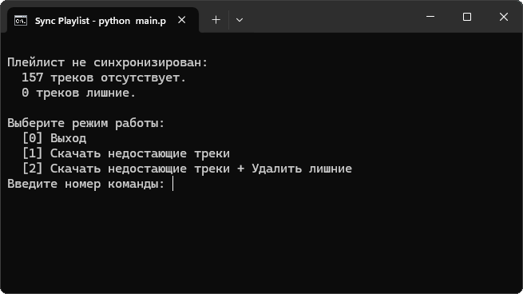

# Yandex Music Downloader
This tool allows you to download and sync playlists from Yandex Music by using [Yandex Music API](https://github.com/MarshalX/yandex-music-api)

## Overview


## Usage
* Install [yandex-music](https://github.com/MarshalX/yandex-music-api) and [mutagen](https://github.com/quodlibet/mutagen) libraries
    ```shell
    pip install yandex-music
    pip install mutagen
    ```

* Run the `main.py`
    ```shell
    python main.py
    ```
  
* Paste token ([how to get](https://github.com/MarshalX/yandex-music-api/discussions/513#discussioncomment-2729781)) and download folder path into the input fields